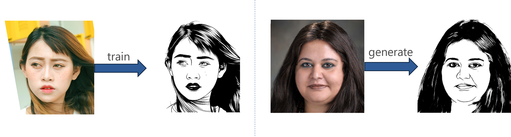

# Face Drawing GAN by Channel Attention and Matrix Product Attention


## Setting

### Clone this repository

```
git clone https://github.com/HideyukiOgura/Face-Drawing-GAN.git
cd face_drawing_gan
```

### Install dependencies

We provide an environment.yml file listing the dependences and to create a conda environment. Our model uses Pytorch 1.7.1
```
conda env create -f environment.yml
conda activate drawings
```

## Use the following command to install CLIP (only needed for training).
```
conda activate drawings
pip install git+https://github.com/openai/CLIP.git
```
## Testing

Pre-trained model is available [here](https://drive.google.com/file/d/1teLRXpgE9K0gfI-YYfx_FUlnM55dVonh/view?usp=drive_link).
Place the model weights in checkpoints/well_trained.

run pre-trained model on images in --dataroot.
```
python test.py --name well_trained --dataroot path_to_real_images
```
Results will be saved to the results directory by default. You can change the save location by specifying the file path with --results_dir.

## Training

To train a model with name myexperiment from scratch use the following command.
```
python train.py --name myexperiment \
--dataroot path_to_real_face_images \
--root2 path_to_style_face_images \
--no_flip
```
